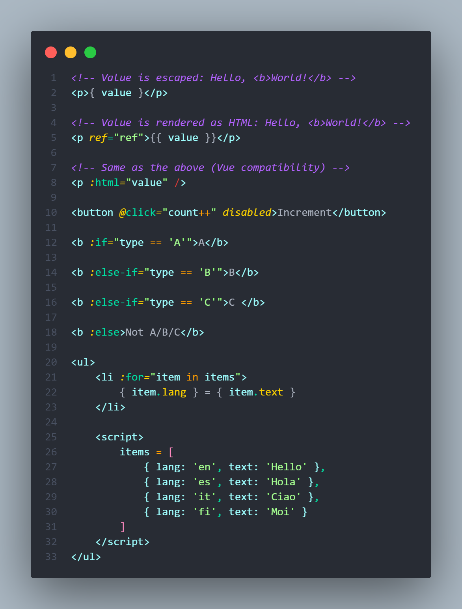
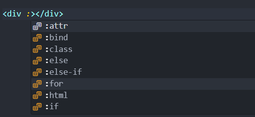
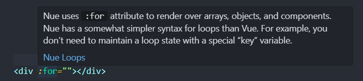
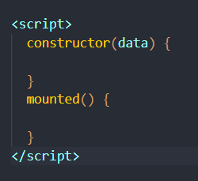

[](https://marketplace.visualstudio.com/items?itemName=yaoyuanzhang.nue)
[](https://github.com/yyz945947732/vscode-nue/blob/master/README.md)

# Nue Language Support

## Features

- [Syntax-highlighting](#syntax-highlighting)
- [Snippets](#snippets)
- [Auto-completion](#auto-completion)

### Syntax Highlighting



### Snippets

#### `nfor`

```js
:for="(item, index) in array"
```

#### `nif`

```html
<div :if="condition"></div>
<div :else-if="condition"></div>
<div :else="condition"></div>
```

#### `nscript`

```html
<script>
  constructor(data) {

  }
  mounted() {

  }
  updated() {

  }
  unmounted() {

  }
</script>
```

#### `nattr`

```html
<div :attr="data">
  <script>
    data = {

    }
  </script>
</div>
```

### Auto Completion





## Nue docs

If you need documention on how to use Nue JS:

[Nue Github](https://github.com/nuejs/nuejs)
[Nue Website](https://nuejs.org)

## Notice

- If you are not seeing any style, set your file associations for "*.nue" to html.
- This extension will affect all html type files, just like [EJS Language Support](https://github.com/Digitalbrainstem/ejs-grammar). So both `.nue` file and `.html` file will affect by this extension.
- This extension disables the `html.validate.scripts` setting by default so that the following script will not report syntax errors.

  

  However, the actual error message inside script tag cannot be detected either. if you still want to detect script error. you can add the following to your settings file.

  ```json
  "html.validate.scripts": {
    "html.validate.scripts": true,
  },
  ```

## Credits

The following projects have given me a lot of inspiration:

- [vetur](https://github.com/vuejs/vetur)
- [EJS Language Support](https://github.com/Digitalbrainstem/ejs-grammar)

## License

[MIT](https://github.com/yyz945947732/vscode-nue/blob/master/LICENSE)
